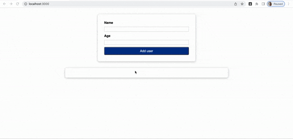

# Project: react_small_project

### About project:

This project was done according to the lectures (75-84) on udemy ["Modern React from zero to pro"](https://www.udemy.com/course/react-np/). 

"react_small_project" is an app on React where we can add name and age of person and if it age will be smaller than 0 or fields will not be filled, we will see a popup with an error.

### Tehnology: 

* HTML
* CSS
* JavaScript
* React
* Git

# Installation
To run on a local machine, you need:

1. Install npm dependencies:
### `npm install`
2. Run in development mode:
### `npm run start`

If everything went right, the project will be launched on [http://localhost:3000](http://localhost:3000)

# Additional programs which I used:

Quick Time Player on Mac

Video to gif was done through [https://ezgif.com/video-to-gif](https://ezgif.com/video-to-gif)

Optimization of images was done through [https://ezgif.com/optimize](https://ezgif.com/optimize)

# Preview

